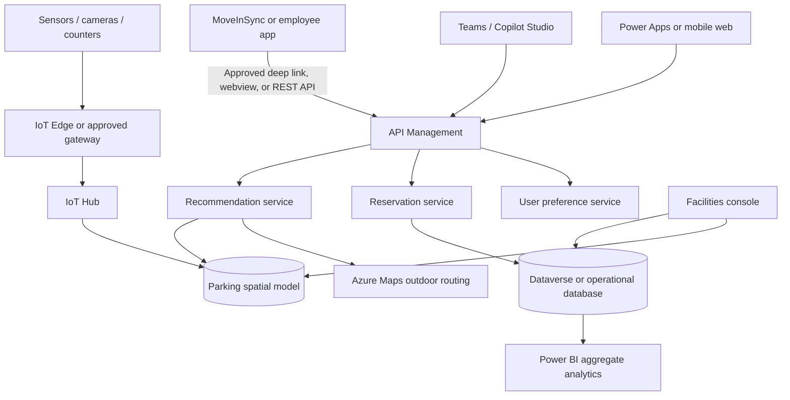

# ParkWise HYD — Technical Guide

## 1. Executive technical summary

ParkWise HYD is a privacy-first parking orchestration layer. It is designed to sit between:

1. Employee arrival intent from an enterprise commute or workplace application.
2. Parking inventory and real-time occupancy metadata.
3. Campus gate, closure, accessibility, and routing rules.
4. A recommendation and reservation service.
5. Employee and Facilities experiences.

The hackathon implementation is a responsive Progressive Web App (PWA) written with HTML, CSS, and browser-native JavaScript. It intentionally has no framework or build dependency, making it reliable to run from a stall laptop. It contains a simulated MoveInSync shell and a replaceable integration adapter.

The prototype demonstrates the experience and service boundaries. It does not claim a production connection to MoveInSync or campus infrastructure.

## 2. Problem being solved

Parking is not only an inventory problem. Employees need a decision before and during arrival:

- Which facility and zone should I use?
- Which campus gate is valid today?
- Is the availability live, recently observed, or forecast?
- Can I reserve an eligible bay?
- What happens if I do not arrive?
- How do temporary closures affect my route?
- Where did I leave my car?

Facilities needs a separate operational view:

- Current and forecast occupancy.
- Uneven utilization between zones.
- Maintenance closures and manual overrides.
- Reservation no-shows and auto-releases.
- Sensor freshness and health.
- Aggregate outcomes without named employee parking histories.

ParkWise combines those concerns into one journey rather than presenting another static availability screen.

## 3. Hackathon architecture

```mermaid
flowchart LR
    A[MoveInSync-style employee shell] -->|Arrival intent| B[MoveInSync adapter]
    B --> C[ParkWise PWA]
    C --> D[Recommendation simulation]
    C --> E[Reservation state machine]
    C --> F[Gate and garage guidance]
    C --> G[QR check-in]
    E -->|Status events| B
    F -->|Campus arrival| B
    G -->|Parking completed| B
    B --> H[(Browser localStorage event log)]
    C --> I[Service worker cache]
```



### Why a PWA?

- Runs on desktop, kiosk, tablet, Android, and iOS browsers.
- Installable from a browser without an app-store dependency.
- Can be embedded in an approved webview or launched by deep link.
- Reuses one responsive codebase for a stall and mobile demonstration.
- Supports offline caching of the static application shell.
- Provides a direct migration path to a managed web application.

### Why no framework?

The prototype uses native browser APIs so it can run without package restore, a JavaScript build tool, or internet access at the stall. A production implementation could use React, Power Apps, or the host application's approved mobile technology.

## 4. Application components

### `index.html`

Defines every application screen:

1. MoveInSync-style employee home.
2. Arrival planning.
3. AI recommendation.
4. Bay selection and reservation.
5. Gate navigation and reservation countdown.
6. Garage-level guidance.
7. QR check-in.
8. Parked confirmation and return route.

Screens use `data-screen` attributes. Only the active screen is displayed.

### `styles.css`

Contains:

- ParkWise visual tokens and colors.
- Kiosk/desktop two-column layout.
- Responsive mobile layout at widths below 760 pixels.
- Touch-friendly controls.
- Parking bay state styles.
- Route, garage, and vehicle-location visualizations.
- MoveInSync-style host shell.
- Accessible non-color-only labels and text.

### `app.js`

Acts as the client-side application controller:

- Changes screens with `showScreen`.
- Updates the journey tracker with `setJourneyStep`.
- Reads arrival context from the adapter.
- Builds 20 demonstration bays.
- Runs a ten-minute reservation countdown.
- Simulates changing occupancy every six seconds.
- Publishes integration lifecycle events.
- Handles PWA installation.
- Registers the service worker.

The prototype state is intentionally simple and memory-based. Production state belongs in a server-side system of record.

### `moveinsync-adapter.js`

Isolates all host-application integration:

```javascript
window.moveInSyncAdapter.getArrivalIntent();
window.moveInSyncAdapter.publishParkingStatus(type, payload);
window.moveInSyncAdapter.openTransportHome();
```

The prototype adapter returns simulated identity and arrival context and records outgoing events in `localStorage`. The UI does not need to change when the adapter is replaced with approved APIs.

### `manifest.webmanifest`

Defines:

- Application name and short name.
- Standalone display mode.
- Portrait orientation.
- Theme and background colors.
- Application icon.

### `service-worker.js`

Caches the application shell and supports network-first reads with a cache fallback. It does not cache authenticated API data because none exists in the prototype.

## 5. End-to-end data flow

### Step 1: Employee opens ParkWise

The simulated MoveInSync shell calls:

```javascript
const context = await moveInSyncAdapter.getArrivalIntent();
```

Example response:

```json
{
  "destination": "Building 4",
  "arrivalTime": "10:00",
  "transportMode": "registered_vehicle",
  "source": "MoveInSync employee app prototype"
}
```

ParkWise pre-populates the destination and arrival time. In production, only explicitly approved context should be transferred.

### Step 2: Recommendation

The prototype returns MLCP Level 4, Zone B with:

- Current availability.
- Walking time.
- Correct gate.
- Confidence.
- Plain-language rationale.
- Backup option.

The displayed occupancy varies periodically to represent live telemetry.

### Step 3: Reservation

The employee selects bay B-17. The reservation model includes:

- Reservation ID.
- Bay ID.
- Arrival time.
- Grace period.
- Auto-release time.
- Reservation status.

The prototype emits:

```json
{
  "type": "parking_reserved",
  "payload": {
    "reservationId": "PW-2048",
    "bay": "B-17",
    "expiresInSeconds": 600
  }
}
```

### Step 4: Campus arrival

The UI guides the employee through Gate 3 to MLCP Level 4, Zone B. Reaching the gate emits `campus_arrival`.

### Step 5: Check-in

The employee simulates scanning the bay QR. The reservation timer stops, the bay is marked occupied, and `parking_completed` is published.

### Step 6: Return journey

The UI stores the selected bay for the session and displays the pedestrian return route. A production design should apply purpose-based retention and allow deletion.

## 6. Integration event contract

The prototype publishes these events:

| Event | When emitted | Important fields |
|---|---|---|
| `parking_started` | ParkWise opens | destination, arrival time |
| `recommendation_created` | Recommendation appears | facility, level, zone |
| `parking_reserved` | Hold is confirmed | reservation ID, bay, expiry |
| `campus_arrival` | Employee reaches gate | gate |
| `parking_completed` | QR check-in succeeds | reservation ID, parking location |
| `returned_to_transport_home` | Employee exits ParkWise | timestamp |

All prototype events are stored under:

```text
parkwise.moveinsync.integration.events
```

in browser `localStorage`. This is for demonstration only.

## 7. Recommendation design

A production recommendation can be expressed as a weighted score:

```text
score =
    availability_score
  + confidence_score
  + destination_distance_score
  + accessibility_match_score
  + gate_route_score
  + underutilization_score
  - closure_penalty
  - congestion_penalty
```

### Inputs

- Current zone or bay occupancy.
- Telemetry freshness.
- Forecast occupancy at the selected arrival time.
- Destination building.
- Walking distance.
- Accessible or EV requirement.
- Gate status.
- Maintenance closures.
- Reservation eligibility.

### Output

```json
{
  "facilityId": "HYD-MLCP",
  "levelId": "L4",
  "zoneId": "B",
  "gateId": "GATE-3",
  "confidence": 0.82,
  "reasonCodes": [
    "SHORTEST_RELIABLE_WALK",
    "LEVEL_3_NEAR_CAPACITY",
    "LEVEL_5_PARTIAL_CLOSURE"
  ],
  "backupZoneId": "L5-D"
}
```

Forecast availability must always be labeled as a prediction rather than a guarantee.

## 8. Recommended production architecture



### Suggested technology choices

| Concern | Hackathon | Production option |
|---|---|---|
| Employee UI | Native PWA | Power Apps, managed PWA, or approved host webview |
| Conversation | Scripted UI | Copilot Studio in Teams |
| Identity | Simulated SSO | Microsoft Entra ID and host-approved SSO |
| Host integration | Local adapter | MoveInSync UAT REST API or supported deep link |
| State | Browser memory | Dataverse, Azure SQL, or approved service database |
| Occupancy | Random simulation | IoT Hub metadata from counters, cameras, or bay sensors |
| Spatial model | Static HTML | Dataverse model or Azure Digital Twins |
| Outdoor route | Static diagram | Azure Maps |
| Indoor route | Static diagram | Approved SVG/CAD indoor map |
| Analytics | UI cards | Power BI aggregate dashboards |
| Notifications | Toasts | Power Automate and Teams Adaptive Cards |

Azure Maps Creator indoor wayfinding should not be used because that indoor service was retired in 2025. Standard Azure Maps can support outdoor routing, with an independently supported indoor-map approach.

## 9. Production data model

### Core entities

| Entity | Example fields |
|---|---|
| Campus | campus ID, name, time zone |
| Gate | gate ID, status, allowed vehicle type, route rule |
| Facility | facility ID, campus ID, type |
| Level | level ID, facility ID, sequence |
| Zone | zone ID, level ID, capacity, status |
| Bay | bay ID, zone ID, type, reservable, status |
| OccupancyObservation | asset ID, state, confidence, observed time, source |
| Closure | target ID, start, end, reason, entered by |
| Reservation | ID, employee subject ID, bay/zone ID, expiry, status |
| ParkingSession | reservation ID, check-in time, check-out time |
| DeviceHealth | device ID, health, last heartbeat |

### State values

```text
available | occupied | reserved | closed | uncertain
```

`uncertain` is important. The system must not turn stale or contradictory telemetry into a false availability claim.

## 10. MoveInSync production integration

Publicly available MoveInSync information confirms enterprise SAML SSO and customer/partner API integration patterns, but the required Microsoft tenant contract is not included in this prototype.

Before production work:

1. Obtain official MoveInSync UAT API or deep-link documentation.
2. Confirm whether ParkWise is embedded, deep-linked, or added natively.
3. Exchange SAML or other supported identity metadata.
4. Agree employee identifier and claim mapping.
5. Define scopes and API rate limits.
6. Define retry, idempotency, and failure behavior.
7. Complete privacy, Security, RE&F, and application-owner reviews.
8. Test in UAT with non-production employee and parking data.

The adapter pattern ensures only `moveinsync-adapter.js` or its production equivalent must understand that contract.

## 11. Security and privacy

### Identity and authorization

- Authenticate employees with Microsoft Entra ID through the approved host flow.
- Use role-based access for employee, Facilities, Security, and administrator functions.
- Do not treat a parking sticker, bay QR, or vehicle ID as user authentication.
- Validate authorization server-side for every reservation mutation.

### API security

- HTTPS only.
- OAuth/JWT or the contract required by the host.
- Never place production credentials in browser JavaScript.
- Use API Management or an approved backend-for-frontend.
- Apply idempotency keys to reservation creation and check-in.
- Rate-limit mutations.
- Audit Facilities overrides.

### Privacy

- Prefer occupancy metadata over stored video.
- Do not use face recognition.
- Avoid ANPR unless separately justified and approved.
- Do not show named parking histories on Facilities dashboards.
- Store employee-to-bay association only as long as needed.
- Make “remember my car” optional.
- Publish clear purpose, retention, access, and deletion notices.

### Safety

- Do not encourage detailed app interaction after campus entry.
- Prefer physical signs, voice prompts, and glanceable guidance.
- Always provide an `unknown` or fallback state.
- Never automatically issue penalties from AI or sensor output.

## 12. Accessibility

- Accessible spaces must be modeled separately from general inventory.
- A requested accessible route must never use stairs.
- Include elevator and ramp state where available.
- Use labels, icons, and shapes—not color alone.
- Support screen readers and large text.
- Maintain touch targets of approximately 44 pixels or larger.
- Validate with employees with disabilities before a pilot.

## 13. Failure handling

| Failure | Expected behavior |
|---|---|
| Occupancy feed is stale | Mark availability uncertain and offer a backup |
| Host API is unavailable | Keep current reservation visible; queue safe status updates |
| Reservation conflict | Reject atomically and return the next option |
| QR cannot be scanned | Allow authenticated manual check-in |
| Gate closes | Recalculate route and notify affected reservations |
| Device is offline | Show cached shell and last-known data timestamp |
| Employee does not arrive | Auto-release after the grace period |
| Sensor disagrees with check-in | Flag for Facilities review; do not penalize automatically |

## 14. Testing strategy

### Unit tests

- Recommendation score and tie-breaking.
- Reservation state transitions.
- Auto-release timing.
- Closure eligibility.
- Accessible route constraints.
- Telemetry freshness.

### Integration tests

- Host context to ParkWise.
- Reservation create/cancel/check-in.
- MoveInSync status callbacks.
- Occupancy events through the spatial model.
- Facilities overrides.

### End-to-end tests

1. Normal reserve and park.
2. Preferred zone fills before arrival.
3. Maintenance closure after reservation.
4. Reservation no-show and auto-release.
5. Accessible bay and route.
6. Offline application shell.
7. Stale sensor state.
8. Return-to-vehicle journey.

### Pilot measurements

- Gate-to-park time.
- Incorrect available recommendations.
- Occupancy variance between zones.
- Reservation no-show rate.
- Auto-released reservations.
- Sensor uptime and stale-state incidents.
- Successful accessible journeys.
- Employee ease score.

## 15. Deployment path

### Hackathon

- Run locally with Python's static HTTP server.
- Use simulated telemetry and adapter events.
- Install as a PWA on the stall device if desired.

### Pilot

- Host in an approved Azure web service.
- Add Entra ID authentication.
- Replace local adapter with MoveInSync UAT contract.
- Store reservations server-side.
- Connect one approved MLCP zone.
- Add Facilities override console.

### Campus scale

- Add all MLCP levels, B2 parking, Building 4 basement, valet, EV, accessible, two-wheeler, and visitor journeys.
- Add aggregate Power BI reporting.
- Establish operational ownership, SLOs, retention, and incident response.

## 16. Important prototype limitations

- The MoveInSync user interface is a visual simulation, not vendor source code.
- No production MoveInSync API is called.
- Identity is simulated.
- Occupancy changes are randomized in the browser.
- Recommendation logic is scripted for the demonstration.
- Bay B-17 is always selected.
- The countdown is client-side.
- The QR code is visual and the scan is simulated.
- Routes are illustrative diagrams.
- `localStorage` is used only as a mock event log.

These boundaries should be stated clearly during the event. The value of the prototype is the complete journey, architecture, and replaceable integration design.
